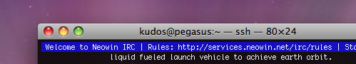

Some people like using irssi, others again like using it over ssh. When <a href="http://f0rked.com/articles/irssi">combined with screen</a>, this gives you a persistent IRC client that stays online even when you're not connected to your shell account.</p> While this is great, it does come with some caveats. Irssi can't access anything on your local machine, so status scripts, like what you are currently listening to, are out. In steps Brandon Fullers <a href="http://brandon.fuller.name/archives/hacks/nowplaying/">Now Playing</a> plugin for iTunes. The software itself isn't great, you can only transmit the song details over FTP, but it does work. The problem here is that I don't have FTP on the same box as irssi. Here's my solution:<!--more-->Set up now playing to upload your song details to your FTP server. Place the following PHP somewhere web accessible.

```php
$file = "/path/to/Now_Playing.xml";
$xml_parser = xml_parser_create();
if ( is_file( $file ) ){
	$fp = fopen( $file, "r" );
	$data = fread( $fp, filesize( $file ) );
	fclose( $fp );
	xml_parse_into_struct( $xml_parser, $data, $vals, $index );
	xml_parser_free( $xml_parser );
	if ( $vals[ $index["NOW_PLAYING"][0] ]["attributes"]["PLAYING"] == 1 )
	{
		foreach ( $index["TITLE"] as $i =&gt; $j )
		{
			$title = $vals[ $index["TITLE"][$i] ]["value"];
			if ( strlen( $title ) &gt; 0 )
			{
				$artist = $vals[ $index["ARTIST"][$i] ]["value"];
				echo "np: " . $title . " by " . $artist;
			}
		}
	}
	else
	{
		echo "np: nothing!";
	}
}
```

Next add the following to your irssi config file (usually ~/.irssi/config) inside the alias section.

```bash
np = "/exec -o - w3m http://yourdomain/np.php";
```

If everything went according to plan, typing /np into irssi will now announce your current playing track.
