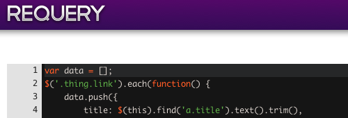

Requery was to be a RESTful JSON web service providing DOM site scraping with Javascript and jQuery.

I built the prototype over the course of a month or so and actually had a pretty decent product. There was the API itself, built using [nodejs](http://nodejs.org) and [express](http://expressjs.com). The web panel was built with python and [pylons](http://pylonsproject.org/) and even has a fully functional sandbox IDE using [ace](http://ace.ajax.org/).

#### What happened?

I decided to abandon the project when I realised that the CPU cost per DOM parse made it something that would be difficult to monetise. I had planned to build in autoscaling and had plans to mitigate process locking, these would have been interesting challenges. These CPU requirements could possibly have been dramatically reduced if I had the skills to produce a native module for nodejs to do it.

The API accounted for things like robots.txt rules, caching and logged CPU time to use as a method of billing. The plan had been to allow users a small amount of free CPU time per month to garner adoption.

It's unfortunate that I had to kill the project, but I gained some valuable experience with nodejs and python, both of which I'd only hacked smalls scripts together with in the past. I still think it's a solid idea, just not feasible with currently available technology.

I've dumped the source on [Github](https://github.com/kudos/requery) rather than have it go to waste. It's mostly kludge, but something in there might be useful to someone.
