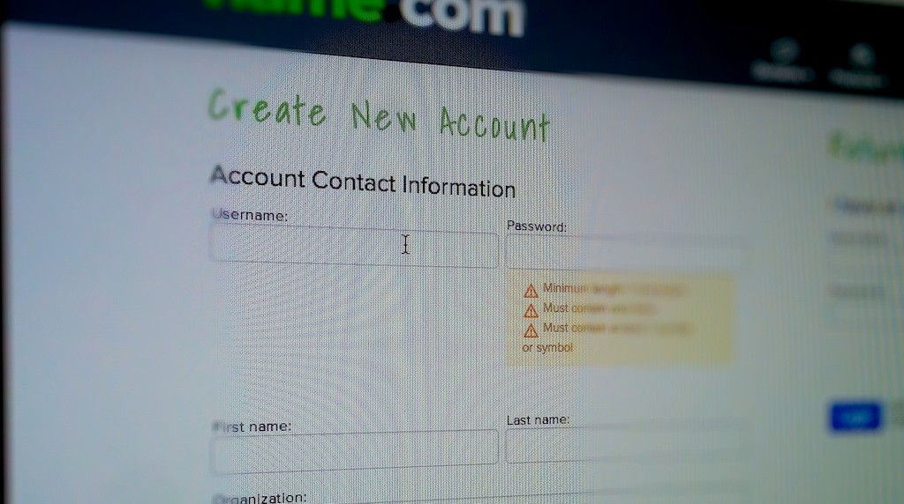

One of the most irritating things for me when signing up to a new website is their insistence that I create a username for it. Sometimes this is unavoidable as they need to display an identity publicly somewhere or there is a technological limitation in some authentication subsystem. Often it's totally arbitrary.<!-- more -->

The signup process should be free of friction to encourage users to complete it. It is therefore incredible to me that I can be forced to go through the username selection process repeatedly until I find an available one. Kudos - not available, Koodos - not available, Kudoz - not available, until I end up with a username I will never remember. All for a service that probably doesn’t need one in the first place.

At this point I'll have already been asked for my email address, which is far more unique than a username. Just use that to identify me.

One recent encounter I had with this phenomenon was signing up to [name.com](http://name.com). I was forced to choose a username (it only took 4 attempts) and they only allowed me to sign in with that username, which is beyond memorable at this point. It may be that they use this username in some part of their service that has technological limitations in the characters that can be used or perhaps their DNS is sharded on a filesystem using the usernames. But that still doesn't explain forcing the use of usernames instead of emails for authentication.

I made this mistake in the early days of [Localhostr](http://localhostr.com) but with the public launch earlier this year I removed usernames entirely. They were not needed for public identification of users on the service and they were not needed by any of the technology it was built on. I made the immature decision to include them back in 2006 when I was still beginning to learn about building web applications.

I think this makes me acutely aware of it when other sites impose the same requirement. I always wonder whether they really need a username from me in order to let me use their service.

So for my sake and the sake of your future users, please take another look at your service and ask yourself whether or not you really require a username. If you do decide that you need usernames, let me log in with my email anyway.

