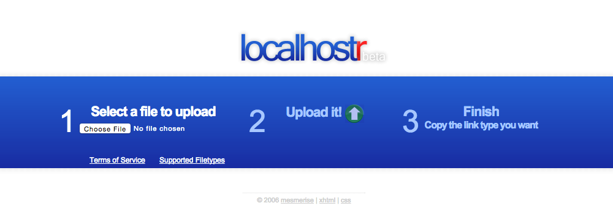
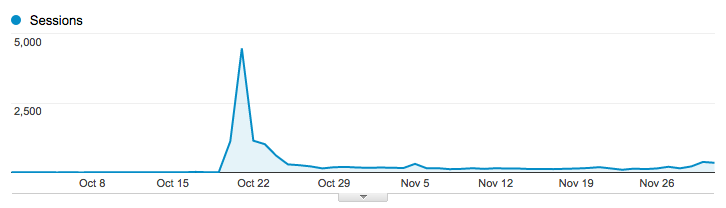
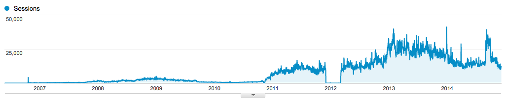
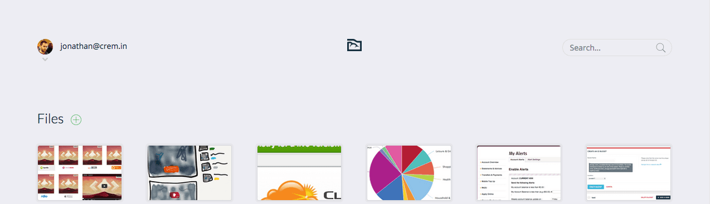

Back in 2006 I started what was then called Localhostr. I was in second year at University and looking to build a web app for the experience. The name was supposed to be a parody on the "web 2.0" trend that was happening around that time, but I really wish I came up with something better now.

At the time, Tinypic and Imageshack were the loathed kings of image sharing, and there wasn't really any way to share other kinds of files easily.<!-- more -->
I figured I had sufficient PHP chops and my $10 Dreamhost account would be enough to take on the challenge. Mostly, I just wanted somewhere I could upload things and easily hotlink them to my friends on IRC and elsewhere.

In early May I put the site online. [Wayback Machine](https://web.archive.org/web/20060521194406/http://beta.localhostr.com/) kindly grabbed a copy.

For the next few months I would get tens of visitors every day. The site did one thing well and I was pretty happy that anyone other than myself used it.

Then on October 20th someone submitted it to [Lifehacker](http://lifehacker.com/208989/host-files-in-a-flash-with-localhostr) and the next day it hit the Digg homepage.

People seemed to like the way it presented the whole process up front as three simple steps.

In hindsight it was an immense opportunity, but I had neither the technical ability or the connections to do anything with. I was still at college and working 4 or 5 days a week just to support myself. Regardless, I was happy to have a project that people liked and used.

Over the next few years it went through some redesigns and rewrites. I discovered Codeigniter, and rewrote it around that. Quickly realised how terrible Codeigniter was and rewrote it in Kohana. Then decided to build my own micro framework and rewrote it with that.

I bounced from Dreamhost to a dedicated server and on to virtual servers.

Somewhere in there I added an API and virus scanning. [Someone](https://twitter.com/simon360) made a dashboard widget for OS X, [someone else](https://twitter.com/mjpa) made a Windows desktop app.

At the end of 2010 in order to further combat drive-by malware uploaders I forced non-image files to have a download confirmation page. This resulted in a bit of an uptick in page views.

That gap in 2012 was a period where I trialled an alternative analytics service. I wish I hadn't now. The spike on the far left is Digg.

PHP had lost its lustre for me, so next I rewrote it in Python with Flask.

I learned enough Objective-C to build a Mac app, and a completed iOS app that got shelved in the wake of the iOS 6-7 design change.

Then another rewrite in Node.js, to facilitate the instant sharing event-driven stuff. It was totally possible with Python and gevent, but it was horrible to work with.

I coincided this most recent rewrite with a rebrand to Hostr. I had never liked the name, and while I didn't think I could drop it completely, I felt this was a good compromise.

That brings us to today, over eight years and a billion downloads later.

Hostr runs on six boxes at Linode, between web nodes, Mongodb nodes and a staging box. The web nodes also act as a hot cache for files, with S3 acting as cold storage.

While this arrangement saves me a few thousand Euros a month in data transfer costs it also ends up being faster for most users. If you're one of my contemporaries serving from S3 directly, you should probably be doing it this way too.

Most months Hostr pays for itself and leaves me with a bit to help with the groceries.

More importantly it remains a great way for me to have a practical application for exploring new technologies.
