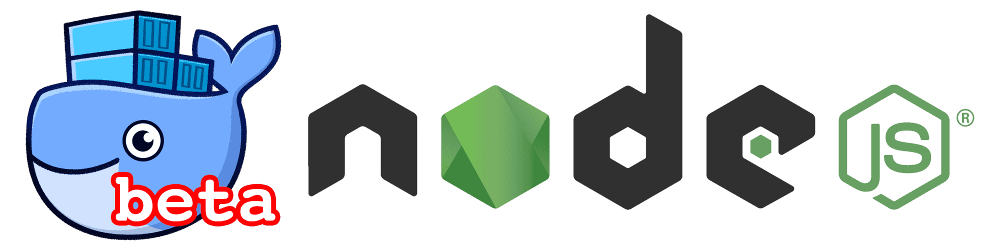

[Docker for Mac](https://docs.docker.com/docker-for-mac/) introduced a new hypervisor based on xhyve/bhyve with the goal of making development using Docker on macOS more seamless. It also introduced [osxfs](https://docs.docker.com/docker-for-mac/osxfs/), a bridging file system for transparently mounting volumes from the host OS through to Docker in the Linux VM. Importantly, this file system supports translating from FSEvents to inotify and removes the need for polling files for changes.

Unfortunately there's still a lot of CPU overhead and bugs, but in my unscientific testing reducing the number of files inside mounted volumes significantly mitigated both problems.



At [Udemy](https://www.udemy.com), we have a pretty hefty Django repository which also houses our frontend and it's build tools. This means a `package.json` and `node_modules` directory.

Let's get a breakdown of where most of our files are.


```bash
# Overall repo file count
❯ django git:(master) find . -type f | wc -l
   57301
# Django codebase
❯ django git:(master) find udemy -type f | wc -l
    5346
# Frontend including our code, bower and npm.
❯ django git:(master) find static -type f | wc -l
   48746
# Just npm packages
❯ django git:(master) find static/node_modules -type f | wc -l
   38658
```


Node's module resolution stuff starts by checking `node_modules` in the current directory and traverses up the directory tree doing the same. To cut down on this overhead, we can tell Node exactly where we put them using `NODE_PATH`. You can use a colon separated list for this, but we don't need anything more than `/node_modules`.

`NODE_PATH` only works for resolution by Node, so we can't easily just tell it to install there. There is the `--prefix` argument of `npm` too, but this only applies to `--global` and we can't use that with a `package.json`.

So we can't `npm install` to a path other than `node_modules` alongside `package.json`, that means we have to copy `package.json` inside the container and off the `osxfs` mount and install there.

Here's a simplified version of our Dockerfile. We use a prebuilt parent image with our dependencies already installed to speed up rebuild time during development.


```bash
FROM udemy/jessie-python-node:3.4-4.5-4
COPY static/package.json /package.json
WORKDIR /
RUN npm install
WORKDIR /app
COPY requirements requirements
RUN pip3 install --no-cache-dir -r requirements/dev.txt
ENV NODE_PATH /node_modules
```


We can now run any node code from `/app/static` and it will use the packages from `/node_modules`. Let's see what our codebase looks like now.

```bash
❯ django git:(master) find . -type f | wc -l
   18643
```

Much better! The remaining big offender for us is a `bower_components` directory (7,678). It's possible for us to do the same with Bower, but it's more invasive and we're migrating those dependencies to npm anyway.

Hopefully Docker ships some performance and stability improvements to osxfs in the near future that negate the need for this. I think in the interim an `.osxfsignore` type of file would let us remove our hacks at least. Doing a two-way ignore is admittedly more complex than something like `.dockerignore`, but [Bittorrent Sync](https://help.getsync.com/hc/en-us/articles/205451055-What-are-sync-StreamsList-sync-IgnoreList-and-the-sync-Archive-folder-) seems to do a reasonable job of it.
