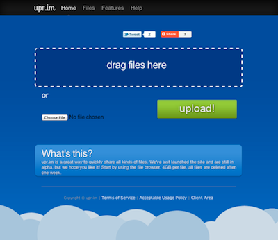

A support ticket came in yesterday at [Minthost](https://minthost.com). A customer wanted to upgrade from an entry package to a Large reseller package. Out of interest, I wondered what kind of site would need those resources but not have hit my radar before. What I saw was unexpected, I immediately recognised a hack job rip off of [Localhostr](http://localhostr.com), another site of mine.

After going back to look at the rip off again later, I thought I recognised the footer style. It was Minthost's. But that wasn't all, the header too was lifted from Minthost, which meant that the entire site was hacked together from my intellectual property.

I already had most of the culprit's personal details, and after visiting his personal site (probably a rip off too) I discovered that he's just a 17 year old swedish kid. I fired off an email, a bit less harsh than it might have been had I thought he was more malicious than stupid.

>Hello,
>
>Your site, <redacted>, uses creative work from my site, localhostr.com, without permission and in violation of copyright. Using it as an inspiration or benchmark to build your own site is fine and even flattering. Stealing my images, markup and CSS is not.
>
>Please take it down or I will be forced to take this matter up with your hosting provider (I own that company too).
>
>Thanks,
>Jonathan Cremin
>Localhostr Founder

A reply came in a couple of hours later.

>Hey there,
>
>I deeply apologize for using any of your content, I have just started venturing into the world of web design/development as a complete newbie and I found your site incredibly inspiring. I did not have, and do not have any intention of using your content for anything other than educational purposes, I was simply analyzing your practices and learning how to use them myself.
>
>Normally I have a close friend who shares his content with me so that I may learn form it, but he is currently away so I decided I would find some other high-quality content to analyze and play with. It has been super helpful and your markup/CSS has taught me many things.
>
>However I realize doing this on a publicly available domain is INCREDIBLY foolish (even downright stupid) and I have already removed it. I have just purchased a new computer and when I started looking at your content I had not yet set up a local development environment.
>
>Your website is absolutely amazing, stable and is what pushed me into canceling my services with Site5 and made the move to Minthost.
>
>I am deeply apologetic and I really hope I have not caused any trouble.
>
>Thanks for understanding,
><redacted>

He pulled the site offline right after that. I think I can accept his story, though I hope he doesn't repeat it in the future. I've kept his name out of this as he's young and it's not my intention to tarnish it. (You could figure it out from the screenshot, but that's not going to get indexed by search engines)

The take away from this for me for now is positive, I designed something worth stealing.
