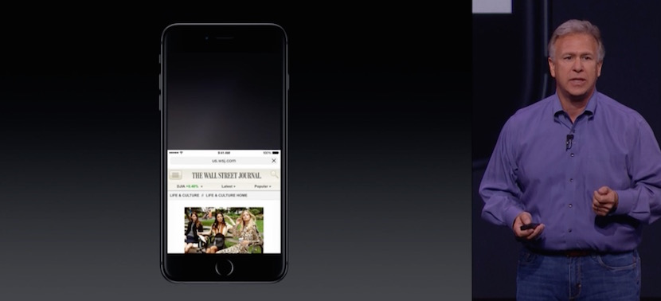

Last week my iPhone 6 Plus arrived. Even coming from a 4.9" Android device I wasn't prepared for how large it would be.

During the keynote Phil Schiller unveiled Reachability.<!-- more -->

Phil had this to say about it:

> What's Reachability? Well if you double touch, not even press, just double touch touch ID button this is what happens. The whole display slides down so you can reach anything at the top without moving your hand off the bottom of the display. <strong>It's so convenient and intuitive</strong> if you really like to use it.

Is anyone really buying that?

It feels like a hack layered on top of past design decisions instead of the full interaction rework a 5.5" phone deserves. That's probably asking too much, so why did they build this phone at all?

I want a phone I can use one-handed without hand acrobatics and that isn't so top heavy that I will develop RSI just supporting the weight of it.

I've returned my 6 Plus and replaced it with its smaller, perfect-sized sibling.
